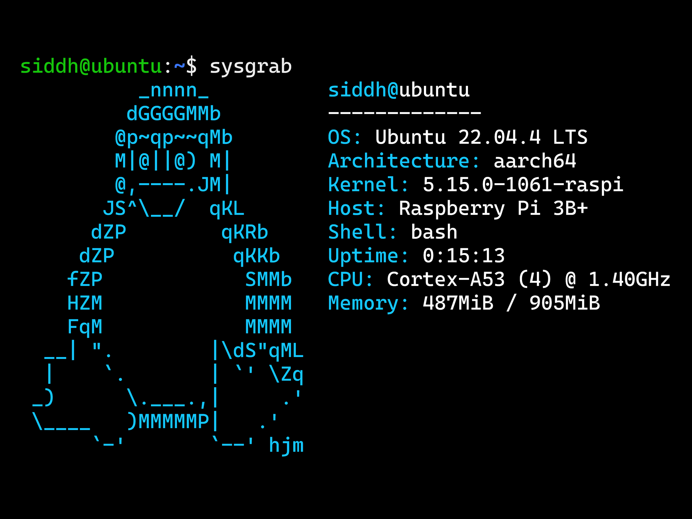

# Sysgrab

<p align="center"></p>

Customizable system information fetching tool for Linux systems.

Written in C, with CMake for build automation and GitHub Actions for CI/CD to GitHub Releases.

## About

Sysgrab displays system details such as OS, architecture, CPU, memory, and more in the terminal.

Users can configure Sysgrab's colors, the ordering of data points, and add ASCII art of their choice by editing the configuration files.

Sysgrab is compatible with all Linux distributions.

## Setup

1. **Download the latest release:**

    Go to the [Releases](https://github.com/siddhp1/Sysgrab/releases/) page and download `sysgrab-release.zip` and extract it.

2. **Add Sysgrab to your PATH:**

    Add the extracted directory to your system PATH to make Sysgrab accessible from any directory.

    Add this line to your shell configuration to make the change persistent:

    ```bash
    export PATH=$PATH:/path/to/sysgrab-directory
    ``` 

3. **Configure Sysgrab:**

    To configure the colors and ordering, edit the `config.yaml` file located in the extracted directory.
    
    To configure the art, create a text file with ASCII art, and add the file path to the `config.yaml` file.


## Usage

Run Sysgrab with the following command:

```bash
sysgrab [OPTIONS]
```

Options:
```text
  (no options)                  Display system information
  -h, --help                    Show a help message and exit
  -v, --version                 Display version information and exit
  -d, --delete-logs             Delete logs
```

## License

This project is licensed under the MIT License.
